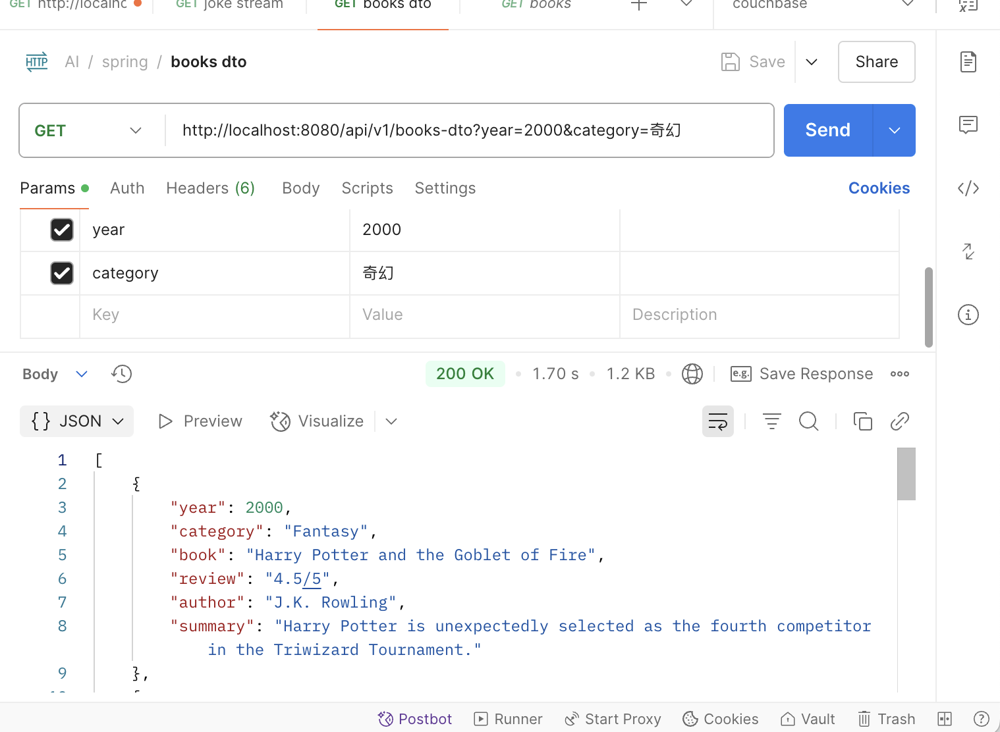

## spring ai quick start

>- basic ai chat
>- ai response to java object 
>- 使用 groq 作為chat model (兼容openai)


### application.properties
```properties
spring.ai.openai.api-key=${OPENAI_API_KEY}
spring.ai.openai.base-url=https://api.groq.com/openai
spring.ai.openai.chat.options.model=llama3-70b-8192
```

### .env
```
OPENAI_API_KEY=gsk_123
```

### ChatClient
需要先使用ChatClient.Builder
```java
@Configuration
public class AIConfig {

    @Bean
    ChatClient chatClient(ChatClient.Builder builder) {
        return builder.build();
    }
}
```


#### basic chat
```java
String prompt = "請使用繁體中文說一個關於 {topic} 的笑話, 不需要任何的寒暄結尾";
chatClient.prompt()
.user(u -> u.text(prompt).param("topic", "ai"))
.call()
.content();
```


#### chat stream
```java
chatClient.prompt()
.user(u -> u.text(prompt).param("topic", topic))
.stream()
.content();
```
```java
@GetMapping(value = "/", produces = MediaType.TEXT_EVENT_STREAM_VALUE)
```


#### chat to dto
使用entity(class)會自動轉換, 且帶入prompt

加入.advisors(new SimpleLoggerAdvisor())
並設定
```
logging.level.org.springframework.ai.chat.client.advisor=DEBUG
```
```java
public List<BookDetail> getBooksDto(String category, String year) {
    return chatClient.prompt()
            .user(u -> u.text("請建議我幾本 {year} 年時 {category} 類型的暢銷書。")
                    .param("category", category)
                    .param("year", year)
            )
            .advisors(new SimpleLoggerAdvisor())
            .call()
            .entity(new ParameterizedTypeReference<>() {});
}
```



```
2025-04-24T15:17:03.086+08:00 DEBUG 3952 --- [springai] [nio-8080-exec-3] o.s.a.c.c.advisor.SimpleLoggerAdvisor    : request: AdvisedRequest[chatModel=OpenAiChatModel [defaultOptions=OpenAiChatOptions: {"streamUsage":false,"model":"llama3-70b-8192","temperature":0.7}], userText=請建議我幾本 {year} 年時 {category} 類型的暢銷書。, systemText=null, chatOptions=OpenAiChatOptions: {"streamUsage":false,"model":"llama3-70b-8192","temperature":0.7}, media=[], functionNames=[], functionCallbacks=[], messages=[], userParams={category=奇幻, year=2000}, systemParams={}, advisors=[org.springframework.ai.chat.client.DefaultChatClient$DefaultChatClientRequestSpec$1@3b337bdf, org.springframework.ai.chat.client.DefaultChatClient$DefaultChatClientRequestSpec$2@32d03d89, org.springframework.ai.chat.client.DefaultChatClient$DefaultChatClientRequestSpec$1@13b40580, org.springframework.ai.chat.client.DefaultChatClient$DefaultChatClientRequestSpec$2@3ab770db, SimpleLoggerAdvisor], advisorParams={}, adviseContext={formatParam=Your response should be in JSON format.
Do not include any explanations, only provide a RFC8259 compliant JSON response following this format without deviation.
Do not include markdown code blocks in your response.
Remove the ```json markdown from the output.
Here is the JSON Schema instance your output must adhere to:
```{
  "$schema" : "https://json-schema.org/draft/2020-12/schema",
  "type" : "array",
  "items" : {
    "type" : "object",
    "properties" : {
      "author" : {
        "type" : "string"
      },
      "book" : {
        "type" : "string"
      },
      "category" : {
        "type" : "string"
      },
      "review" : {
        "type" : "string"
      },
      "summary" : {
        "type" : "string"
      },
      "year" : {
        "type" : "integer"
      }
    },
    "additionalProperties" : false
  }
}```
}, toolContext={}]
```